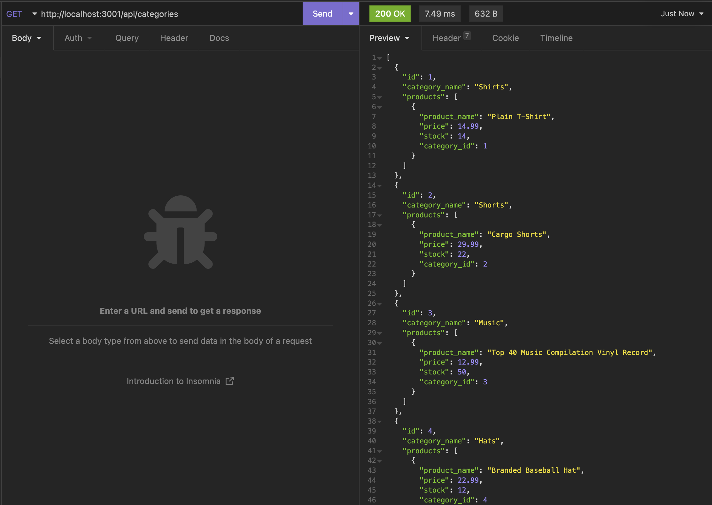

<!-- https://github.com/othneildrew/Best-README-Template -->

<div id="top"></div>

<!-- PROJECT LOGO -->
<br />
<div align="center">
  <a href="https://github.com/GarrettLockhart/e-commerce-back-end">
    
  </a>

<h3 align="center">E-commerce back-end using ORM</h3>

  <p align="center">
    The back end logic for a simple ecommerce app, uses nodejs, expressjs, sequelize, MySQL.
    <br />
    <br />
    <br />
    <a href="https://github.com/GarrettLockhart/e-commerce-back-end/issues">Report Bug</a>
    ·
    <a href="https://github.com/GarrettLockhart/e-commerce-back-end/issues">Request Feature</a>
  </p>
</div>
<br />
<br />
<br />

<!-- TABLE OF CONTENTS -->
<details>
  <summary>Table of Contents</summary>
  <ol>
    <li>
      <a href="#about-the-project">About The Project</a>
        <li><a href="#built-with">Built With</a></li>
    </li>
    <li><a href="#live-site">Live Site</a></li>
  </ol>
</details>
<br />

<!-- ABOUT THE PROJECT -->

## About The Project

This project was built using node.js, express.js, sequelize, and MySQL. All routes are set up using express and the mysql2 package to connect to a MySQL database. You can run all CRUD operations on each table in the database using GET, POST, PUT, DELETE.

### Built With

- [mysql](https://www.mysql.com/)
- [node.js](https://nodejs.org/en/)
- [Express.js](https://expressjs.com/)
- [Sequelize](https://sequelize.org/)
- [dotenv](https://www.npmjs.com/package/dotenv)
- [mysql2](https://www.npmjs.com/package/mysql2)

<br />

## Installation instructions

Once you have the project on your computer you can open it in your command line and run

```
npm install
```

After that has finished downloading the node_modules folder you can go back to the command line and log into MySQL shell. (Be sure to use your own credentials in a .env file in the root directory of the project) Once logged into the MySQL shell you can run:

```
source db/schema.sql
```

After that you will need to exit the MySQL shell and in your terminal run:

```
npm run seed
```

And once you have done that you can run:

```
npm start
```

or to use nodemon

```
npm run dev
```

And then you can do all of your CRUD operations in something like insomnia or postman.

<br />
<br />
<br />

<!-- CONTRIBUTING -->

## Contributing

Any contributions you make are **greatly appreciated**.

If you have a suggestion that would make this better, please fork the repo and create a pull request. You can also simply open an issue with the tag "enhancement".
Don't forget to give the project a star! Thanks again!

1. Fork the Project
2. Create your Feature Branch (`git checkout -b feature/AmazingFeature`)
3. Commit your Changes (`git commit -m 'Add some AmazingFeature'`)
4. Push to the Branch (`git push origin feature/AmazingFeature`)
5. Open a Pull Request

<!-- CONTACT -->

<br />
<br />

## Demo Screenshot and Video Walk through

A walk through video of the application <a href="https://drive.google.com/file/d/1XmRjVjkOToQFlFld5y2JE_gzB4HNpxGL/view?usp=sharing">here.</a>



<p align="right">(<a href="#top">back to top</a>)</p>
